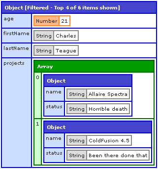
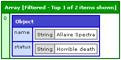

nodedump
========
Outputs variables in a visual, easy to read format based on Adobe ColdFusion's `CFDump` tag with enhancements unique to node.js such as the syntax highlighting of functions. Think of it as `console.log` on steroids.

For example, simply doing `nodedump(user)` gives us:


The above is a dump of the variable `user` created like so:
```javascript
signIn = function(username, password){
	// validate username and password
	if(!validate(username, password))
		return false;
	else 
		updateSession();
	
	// user is signedIn
	this.signedIn = true;
	return true;
};

var user = {
	firstName: 'Charles'
	,lastName: 'Teague'
	,age: 21
	,signedIn: false
	,signIn: signIn
	,projects: [
		{
			name: 'Allaire Spectra'
			,status: 'Horrible death'
		}
		,{
			name: 'ColdFusion 4.5'
			,status: 'Been there done that'
		}
	]
};
```
With `console.log(user)` we get:
```javascript
{ firstName: 'Charles',
  lastName: 'Teague',
  age: 21,
  signedIn: false,
  signIn: [Function],
  projects:
   [ { name: 'Allaire Spectra', status: 'Horrible death' },
     { name: 'ColdFusion 4.5', status: 'Been there done that' } ] }
```
Which is the typical output we have to rely on usually to do our debugging. As our variables become more complicated this becomes a painful way to know what's going on within them.


nodedump is based on the `CFDump` tag of Adobe's ColdFusion which has long been a unique feature allowing developers to understand what's in any variable. Once you get accustomed to the color coding and layout of dumped output, your brain will be able to quickly see and understand what's in any variable you dump with just a glance. Pretty much all the options available for `CFDump` have been included in nodedump.


INSTALLATION
------------

Run this from your bash or command line:

```bash
$ [sudo] npm install -g nodedump
```


USAGE 
-----

First, `require` nodedump:
```javascript
require('nodedump');
```

Then in your view or wherever you output to the browser, whenever you want to dump the contents of a variable do:
```javascript
nodedump(vartodump);
```

EXAMPLE 
-------
The following example sets up a server, creates a test object and dumps it to the browser. Try it!
```javascript
var http = require('http');
require('nodedump');

var server = http.createServer(function(request, response) {
	console.log('Request received',new Date());
	console.log('url:',request.url);
	// skip requests for favicon
	if (request.url.indexOf('favicon.ico') > -1) {
		console.log('favicon requested');
		response.writeHead(500);
		response.end();
		console.log('Request ended');
		return;
	}
	
	// start output to the browser
	response.writeHead(200, {"Content-Type": "text/html"});
	
	var user = {
		firstName: 'Charles'
		,lastName: 'Teague'
		,age: 21
		,signedIn: false
		,projects: [
			{
				name: 'Allaire Spectra'
				, status: 'Horrible death'
			}
			,{
				name: 'ColdFusion 4.5'
				,status: 'Been there done that'
			}
		]
	};
	
	//capture dump
	var output = nodedump(user);
	
	// write response to the browser
	response.write(
		'<html>'
			+ '<head>'
				+ '<title>nodedump example!</title>'
			+ '</head>'
			+'<body>'
				+output
			+'</body>'
		+'</html>'
	);
	response.end();

	console.log('Request ended');
	//console.log('global.bnodedumpinited',global.bnodedumpinited);
}).listen(3000);

console.log("Server has started.");
```

OPTIONS
---------
Options can be passed as an object whenever you `nodedump` a variable as the second parameter, e.g. `nodedump(vartodump, options)`

The available options are:
* `label` - String. Output on the header of the dump.
* `expand` - Boolean/Array. Defaults to `true`. The dump can be collapsed entirely by passing `false`. Simply click on the headers in order to expand them. An array of types can be passed and the keys of those objects will be expanded while everything else collapsed. For e.g. `['Array', 'Object', 'Function']`
* `show` - Array. A list of object keys / array positions to show. Others not in the list will be hidden.
* `hide` - Array. A list of object keys / array positions to hide.
* `top` - Number. The number of array positions of the dump variable to show. For objects, this is the number of keys of the top level to show.
* `levels` - Number. How many nested levels of an object to dump down to.
* `sortKeys` - Boolean. Defaults to `true`. Tells nodedump to output the keys of objects sorted alphabetically. If `false`, keys will be output in whatever order node.js returns them (usually the order in which they were added).
* `syntaxHighlight` - Boolean. Defaults to `true`. Tells whether or not the dump of functions should be syntax highlighted (color-coded).
* `dumpFunctionName` - String. Defaults to `'nodedump'`. Name to use for the nodedump function. E.g. if this is changed to `'dump'` then instead of doing `nodedump(vartodump)` you can do `dump(vartodump)`.

OPTIONS IN ACTION
-----------------
`expand` and `label`

```javascript
nodedump(user1, {expand: false, label: 'User1'});
nodedump(user2, {expand: false, label: 'User 2'});
```

Outputs:


`top` with an object

```javascript
nodedump(user, {top:4});
```

Outputs:



Notice that though the object has 6 keys, only the top 4 were output.

`top` with an array

```javascript
nodedump(user.projects, {top:1});
```

Outputs:



OVERRIDING DEFAULT OPTIONS
--------------------------

Default options can be overriden by calling the `init` method on nodedump. E.g.

```javascript
require('nodedump').init({
	dumpFunctionName: 'dmp'
	,expand: false
});
```

The above would cause you to be able to call nodedump using `dmp(vartodump)` and all nodedumps would be output collapsed by default.

