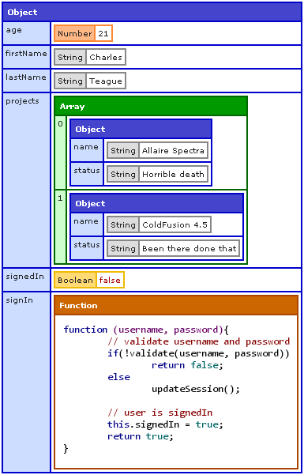

# nodedump
============
Outputs variables in a visual, easy to read format based on Adobe ColdFusion's CFDUMP tag. Think of it as `console.log` on steroids.

The CFDump tag of Adobe's ColdFusion has long been a unique feature of ColdFusion that allows developers to at a glance understand what's in object. Once you get accustomed to the color coding and layout of the dumped output, your brain will be able to quickly see and understand what's in any variable you dump with just a glance. Let's take a comparison. If we create the following:
```javascript
var user = {
	firstName: 'Charles'
	,lastName: 'Teague'
	,age: 21
	,signedIn: false
	,projects: [
		{
			name: 'Allaire Spectra'
			,status: 'Horrible death'
		}
		,{
			name: 'ColdFusion 4.5'
			,status: 'Been there done that'
		}
	]
};
```
And then try to output this with `console.log(user)` we get:
```javascript
{ firstName: 'Charles',
	lastName: 'Teague',
	age: 21,
	signedIn: false,
	projects:
		[ { name: 'Allaire Spectra', status: 'Horrible death' },
			{ name: 'ColdFusion 4.5', status: 'Been there done that' } ] }
```
Which is typical output we have to rely on usually to do our debugging, confirmations, etc. As our variables become more complicated this becomes a painful way to know what's going on with our variables.  With `nodedump(user)`, the output looks like:


